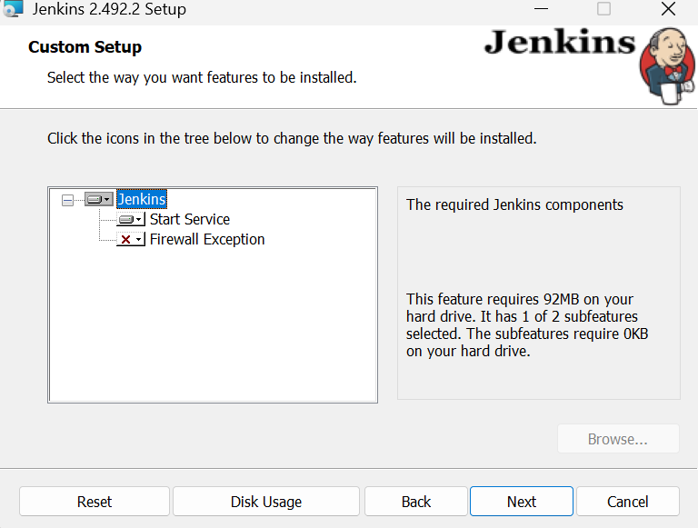
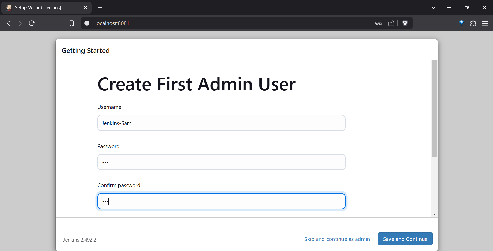

Automated CI/CD Pipeline with Ansible and Docker
Description: Built a fully automated CI/CD pipeline using Ansible, Terraform to configure and deploy applications in Docker containers. Integrate with Jenkins for continuous integration.

Tools/Technologies: Ansible, Docker, Jenkins, Git, Python.

### 1. **Terraform**

- **Purpose**: Infrastructure as Code (IaC) for provisioning and managing cloud resources.

### 2. **Prometheus and Grafana**

- **Purpose**: Monitoring and visualization of metrics.

### 3. **SonarQube**

- **Purpose**: Code quality and security analysis.

### 4. **Snyk**

- **Purpose**: Security scanning for vulnerabilities in dependencies.

## Step 1: Set Up Environment

Install and setup Python, Docker Desktop, Nodejs, Terraform, Jenkins

### **Create Project Directory**

- Open **PowerShell** and run:
    
    `mkdir ansible-ci-cd
    cd ansible-ci-cd`
    

### **Create a Python Virtual Environment**

- In the **root directory (ansible-ci-cd)**:
    
    
    `python -m venv venv
    .\venv\Scripts\Activate`
    
    *Always activate the virtual environment when working on the project*.
    

### **Install Required Python Packages**

- Inside the activated virtual environment:
    
    `pip install ansible docker`
    

## Step 2: Setting Up Terraform

In the **root directory (ansible-ci-cd)** Create a Terraform Configuration File
In VS Code, I created a new file named main.tf in the terraform directory.    
I added the following content to provision a Jenkins Docker container::

`mkdir terraform && cd terraform`

### **Create a Terraform Configuration File**

- In **VS Code**, I created a new file named `main.tf` in the `terraform` directory.
- Added the following content to provision a Jenkins Docker container:

```
terraform {
  required_providers {
    docker = {
      source   = "kreuzwerker/docker"
      version = "2.21.0" # I used this version
    }
  }
}

provider "docker" {}

resource "docker_container" "jenkins" {
  image = "jenkins/jenkins:lts"
  name  = "ci-cd-jenkins"
  ports {
    internal = 8080
    external = 8081
  }
}
```

### Reinitialize Terraform

- Run the following command in **PowerShell** (inside the `terraform` directory):
    
    
    `terraform init`
    


### Apply the Configuration

- Once `terraform init` completes successfully, apply the configuration:
    
    `terraform apply`
    
- Review the changes that Terraform will make and type `yes` to confirm.

[Errors_encountered](notion_notes/Errors_encountered.md)


### Verify the Container

Check running containers:

`docker ps`


Access Jenkins in browser at:

`http://localhost:8081`


Enter the initialAdminPassword (C:\Users\jenkinsuser\AppData\Local\Jenkins\.jenkins\secrets)

- **Create a Dedicated Jenkins User (if you don't have one):**
    - Press **Windows Key + R**, type `lusrmgr.msc`, and press **Enter**.
    - In the Local Users and Groups window, expand **Users**.
    - Right-click in the right pane and select **"New User..."**.
    - Enter a **Username** (e.g., `jenkinsuser`), a **Full name**, and a strong **Password**.
    - Uncheck **"User must change password at next logon"** and check **"Password never expires"** (for simplicity in this guide – you can adjust security settings later).
    - Click **"Create"** and then **"Close"**.
    - **Add the User to the Administrators Group:**
        - Right-click the `jenkinsuser` (or the user you created) and select **"Properties"**.
        - Go to the **"Member Of"** tab.
        - Click **"Add..."**.
        - Type **"Administrators"** and click **"Check Names"**.
        - Click **"OK"** and then **"Apply"** and **"OK"**.
- **Enter the Credentials in the Jenkins Installer:**
    - Select **"Run service as local or domain user"**.
    - In the **Account** field, enter the username in the format: `Samuel-PC\jenkinsuser` ( chosen username).
    - Enter the **Password** you set for the user.
    - Click **"Test Credentials"**.


then , tick on Firewall Exception and install on port 8080



check the container `docker ps`


Acquire the admin password for Jenkins (on docker container using : docker exec ci-cd-jenkins cat /var/jenkins_home/secrets/initialAdminPassword


**Once you have the password:**

1. **Copy the Password:**
    - Select and copy the password from the command output.
2. **Paste into Jenkins Login:**
    - Go to `http://localhost:8081` in browser.
    - Paste the password into the "Administrator password" field.
    - Click "Continue".
3. **Complete the Setup Wizard:**
    - Follow the Jenkins setup wizard.



then (also add e-mail) then the dashboard should look like this :


## Step 3: Setting Up Prometheus and Grafana

### **1. Create Prometheus and Grafana Configuration**

- **Directory**: From the **root directory** (`ansible-ci-cd`), create a folder for configuration files:
    
    `mkdir monitoring && cd monitoring`
    
- **Prometheus Config**:
    - Create a file named `prometheus.yml` in the `monitoring` folder.
    - Add the following content:
        
        yaml
        
        `global:
          scrape_interval: 15s # Default scrape interval
        scrape_configs:
          - job_name: "jenkins"
            static_configs:
              - targets: ["ci-cd-jenkins:8080"] # Jenkins container`
        

### **2. Update Docker Compose File**

- **Directory**: Go back to the **root directory** (`ansible-ci-cd`):
- Add Prometheus and Grafana services to `docker-compose.yml` file:
    - If `docker-compose.yml` doesn’t exist, create one in the **root directory**.
    - Add the following content:
        
        ```jsx
        version: "3.8"
        services:
          prometheus:
            image: prom/prometheus
            container_name: prometheus
            ports:
              - 9090:9090
            volumes:
              - /c/Users/Kumar/OneDrive/Desktop/Ansible/ansible-ci-cd/monitoring/prometheus.yml:/etc/prometheus/prometheus.yml
          grafana:
            image: grafana/grafana
            container_name: grafana
            ports:
              - 3001:3000
        
        ```
        

### **3. Start Prometheus and Grafana Containers**

- **Directory**: Stay in the **root directory**.
- Run the following command to bring up the containers:
    
    `docker-compose up -d`
    

### **4. Verify the Containers**

- Check if the containers are running:
    
    `docker ps`
    
    You should see containers named `prometheus` and `grafana`.
    

### **5. Access Prometheus and Grafana**

- Open Prometheus in browser:
    - URL: `http://localhost:9090`
    
    
    
- Open Grafana in browser:
    - URL: `http://localhost:3000`
    - Default **username**: `admin`
    - Default **password**: `admin` changed to samuel


### **6. Configure Grafana**

- Add Prometheus as a data source in Grafana:
    1. Log into Grafana.
    2. Go to **Configuration** > **Data Sources** > **Add Data Source**.
    3. Choose Prometheus.
    4. Set the URL to:
        
        plaintext
        
        `http://prometheus:9090`
        
    5. Save and test the data source.

## Test and Build our Jenkins file

then :

- Add a new stage to `Jenkinsfile`:
    - **Directory**: create a `Jenkinsfile` in root directory, modify it with the following content:
        
        ```jsx
        pipeline {
            agent any
            stages {
                stage('Build') {
                    steps {
                        echo 'Building the application...'
                        // Add build script or commands here
                    }
                }
                stage('Test') {
                    steps {
                        echo 'Running tests...'
                        // Add test script or commands here
                    }
                }
                stage('Deploy') {
                    steps {
                        echo 'Deploying the application...'
                        // Add deployment scripts or container management here
                    }
                }
            }
        }
        
        ```
        

### **8. Run the Pipeline**

1. Push the updated `Jenkinsfile` to repository.
2. Trigger a build in Jenkins.


## Setting up SYNK

in powershell : 
`npm install -g snyk`

then 

`snyk auth`

Takes to their webpage login there


after login you get : `Your account has been authenticated`


I updated my Jenkins file with :

```jsx
pipeline {
    agent any
    stages {
        stage('Build') {
            steps {
                echo 'Building the application...'
                // Add build script
            }
        }
        stage('Test') {
            steps {
                echo 'Running tests...'
                // Add test script
            }
        }
        stage('Deploy') {
            steps {
                echo 'Deploying the application...'
                // Add deployment scripts
            }
        }
        stage('Container Vulnerability Scan') { // Added Snyk stage
            steps {
                echo 'Scanning Docker image for vulnerabilities...'
                powershell 'snyk container test jenkins/jenkins:lts' // Replaced <image-name> with jenkins/jenkins:lts
            }
        }
    }
}
```


## **Install Ansible on Windows**

Ansible is not natively supported on Windows, so we’ll set it up in a Docker container for seamless integration with our tools.

### **1. Pull the Ansible Docker Image**

1. Open **PowerShell** and run:
    
    `docker pull [quay.io/ansible/ansible-runner](http://quay.io/ansible/ansible-runner)`
    
    - This will pull the official Ansible image from RedHat, This image is maintained by Red Hat, the organization behind Ansible.
- `docker run -it --rm [quay.io/ansible/ansible-runner](http://quay.io/ansible/ansible-runner) bash -c "pip install ansible-lint"`

### **Building a Custom Image with** `ansible-lint`

We’ll create a new Docker image based on `quay.io/ansible/ansible-runner`, but with `ansible-lint` installed persistently.

### **Step 4.1: Create a Dockerfile**

1. In project directory, create a new file named `Dockerfile`:
    
    `New-Item -Path . -Name "Dockerfile" -ItemType File`
    
2. Open the `Dockerfile` in **VS Code** and add the following content:

```jsx
FROM quay.io/ansible/ansible-runner

# Install ansible-lint
RUN pip install ansible-lint

# Set working directory
WORKDIR /runner
```

### **Step 4.2: Build the Custom Docker Image**

1. Build the new Docker image using the `Dockerfile`:
    
    `docker build -t custom-ansible-runner .`
    
    - The `t custom-ansible-runner` assigns a name to our new image.
2. Verify the image was created:
    
    `docker images`
    
    
    
    - Look for `custom-ansible-runner` in the output.

### **Step 4.3: Run Playbook with Validation**

1. Used the custom Docker image to run playbook **with ansible-lint**:
    
    `docker run -it --rm -v ${PWD}:/runner custom-ansible-runner bash -c "ansible-lint /runner/ansible-playbooks/playbook.yml && ansible-playbook /runner/ansible-playbooks/playbook.yml"`
    
2. This ensures:
    - `ansible-lint` is run first to validate the playbook.
    - If the linting passes, the playbook is executed.

1. Verified the image is pulled:
    
    `docker images`
    
    - Look for `ansible/ansible` in the output.

### **Step 2: Creating a Directory for Ansible Playbooks**

1. Opened **VS Code** and created a new folder named `ansible-playbooks` in project root directory.
2. Inside the `ansible-playbooks` folder, created a file called `playbook.yml`:
    - Used the following command in PowerShell:
        
        `New-Item -Path .\ansible-playbooks\playbook.yml -ItemType File`
        

### **Step 3: Write an Ansible Playbook**

1. Opened `playbook.yml` in VS Code and add the following:
    
    - `--
    - name: Setup CI/CD environment hosts: localhost tasks: - name: Install necessary packages package: name: "{{ item }}" state: present loop: - git - docker.io - npm`
    - This playbook installs essential tools like Git, Docker, and npm on our environment.

### **Step 4: Run the Ansible Playbook**

1. Rann the Ansible container with a bind mount to access playbooks:
    
    `docker run -it --rm -v ${PWD}:/ansible ansible/ansible bash`
    
    - This opens a shell inside the Ansible container and mounts project directory.
2. Navigate to the playbook directory:
    
    `cd /ansible/ansible-playbooks`
    
3. Executed the playbook:
    
    `ansible-playbook playbook.yml`
    

### **Step 5: Integrate Ansible with Jenkins**

To automate the execution of Ansible playbooks as part of CI/CD pipeline:

1. Open `Jenkinsfile` in VS Code.
2. Added a new stage for Ansible:
    
    `stage('Provisioning with Ansible') {
        steps {
            echo 'Running Ansible playbook...'
            powershell '''
                docker run -it --rm -v ${PWD}:/ansible ansible/ansible bash -c "cd /ansible/ansible-playbooks && ansible-playbook playbook.yml"
            '''
        }
    }`
    

### **Step 6: Save and Test**

1. Saved the updated `Jenkinsfile`.
2. Trigger a build in Jenkins and monitor the **Console Output** for the Ansible stage execution.
